

<!-- Banner-->
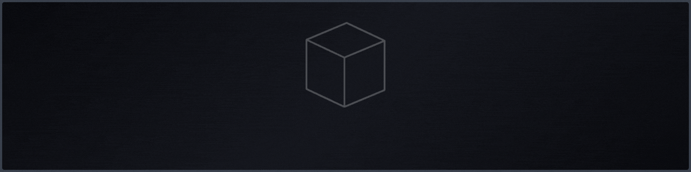

<!-- Efeito de digitação -->

<!--Aberto a oportunidades-->

## 🚀 Sobre mim

Dev formado em Análise e Desenvolvimento de Sistemas, cursando pós-graduação em Segurança Cibernética. Gosto de construir aplicações bem estruturadas e estou sempre aprendendo tecnologias novas através de projetos próprios, aplicando boas práticas de programação em diferentes contextos.

## 💻 Tecnologias e Ferramentas

Front-end 
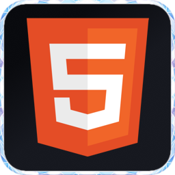
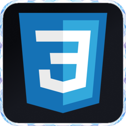
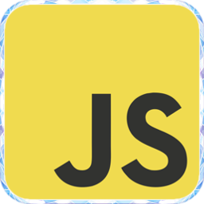
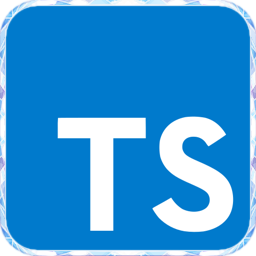
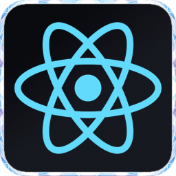
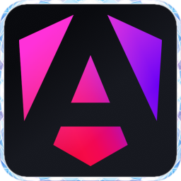
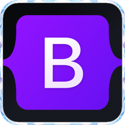

Back-end 
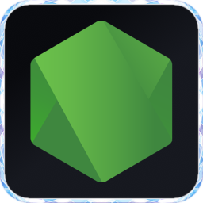

Banco de dados 

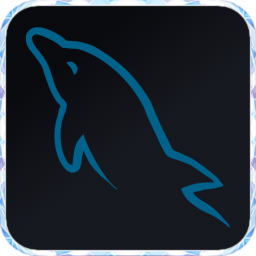

Linguagens 
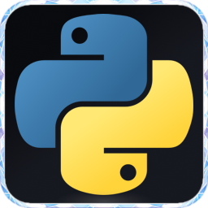
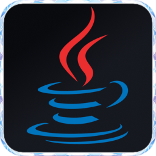

CMS 

Ferramentas 
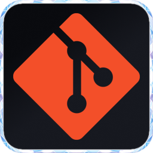
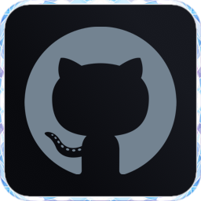

## 🐍 Atividade

  

## 📫 Contato

 
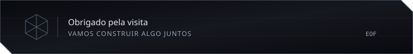